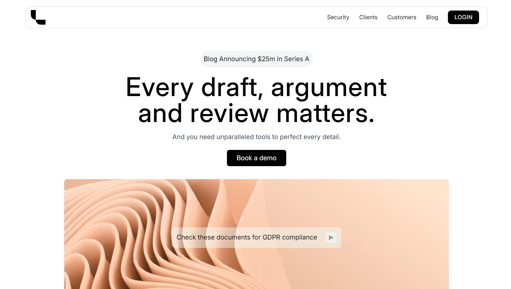

# 🌐 Leya - Sleek and Minimal Single-Page Application

**Leya** is a sleek and minimal single-page application built with **React JS**, designed to serve as a practical example for developing responsive and efficient web applications. It emphasizes clean design, a user-friendly interface, and optimized performance, making it an ideal resource for practicing modern web development skills.

---

## ✨ Key Features

- 🎯 **Minimal Design**: A clean and intuitive interface that enhances user experience by keeping things simple and straightforward.
- 📱 **Responsive Layout**: Ensures seamless adaptation to various devices and screen sizes, providing accessibility across phones, tablets, and desktops.
- ⚡ **Efficient Performance**: Powered by React JS to deliver fast, smooth, and dynamic interactions.

---

## 🛠️ Technologies Used

- ⚛️ **React JS**: JavaScript library for building interactive user interfaces.
- 🎨 **Tailwind CSS**: Utility-first CSS framework for rapid and modern UI development.
- 📄 **HTML5 & CSS3**: The core web technologies for structuring and styling the application.
- 🖥️ **JavaScript (ES6+)**: Modern JavaScript syntax for functionality and interactivity.

---

## 🎯 Purpose

Leya is a resource for developers aiming to:

- 🖌️ Learn **responsive design** and layout techniques.
- 🔄 Practice **single-page application (SPA)** architecture using React.
- 💡 Explore the benefits of clean, **minimal UI/UX** design principles.

---

## 🚀 Getting Started

To run this project locally, follow these steps:

### 📋 Prerequisites

Ensure that you have **Node.js** and **npm** installed on your machine.

### 🔧 Installation

1. **Clone the repository:**
   ```bash
   git clone https://github.com/yourusername/leya.git
   ```
2. **Navigate to the project directory:**
   ```bash
   cd leya
   ```
3. Install dependencies:
   ```bash
   npm i
   ```

---
## ▶️ Running the Project
  ```bash
  npm run dev
  ```
---
## 🌍 Demo
You can view the live demo of Leya here:

🔗 [Website Demo](https://leya.vercel.app/)

---

## 🎉 Happy Coding!

Thank you for checking out **Leya**! If you find this project helpful, feel free to share it with others or contribute to its development.

Happy coding! 🚀
